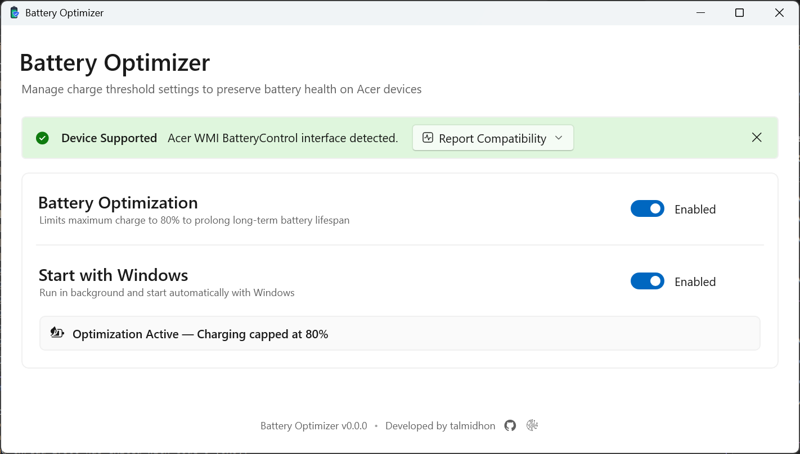
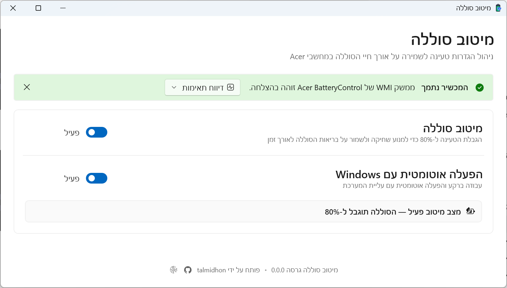

# 🔋 Acer Charge Limiter (Battery Optimizer)

[](https://github.com/talmidhon/AcerChargeLimiter/releases)
[](LICENSE.txt)

A lightweight, modern, native Windows application built with **WinUI 3 (C++/WinRT)** to control battery charging thresholds (80% / 100%) on Acer laptops.

Designed as a clean, high-performance alternative to heavy OEM companion software like *Acer Care Center* or *PredatorSense*.

---

## 📸 Screenshots

| English Interface (LTR) | Hebrew Interface (RTL) |
| :---: | :---: |
|  |  |

---

## ✨ Key Features

* 🚀 **Native & Fast:** Built natively with **C++/WinRT** and **WinUI 3** for Windows 11 Fluent Design aesthetics with near-zero memory footprint.
* ⚡ **Direct WMI Control:** Communicates directly with the `ROOT\WMI` (`BatteryControl`) ACPI driver interface to instantly apply charge limits without background pollers.
* 🌐 **Full RTL & Multilingual Support:** Automatic system language detection with tailored Right-To-Left (RTL) layout for Hebrew and Left-To-Right (LTR) for English.
* 📌 **System Tray Integration:** Minimizes cleanly to the Windows notification area with full status tooltips and quick toggle context menus.
* 🔄 **Task Scheduler Auto-Start:** Automatically launches `--minimized` on system logon using native Windows Task Scheduler without requiring UAC prompts on startup.
* 🛡️ **Self-Elevation & Single Instance:** Safely requests Administrator privileges only when needed to interact with system drivers and prevents duplicate app instances.
* 📦 **Auto-Update Engine:** Built-in asynchronous update checker via GitHub Releases.

---

## 💻 Confirmed Compatible Devices

The following Acer laptop series have been verified to support direct WMI charge control:

| Series | Tested Model | Status |
| :--- | :--- | :---: |
| **Acer Aspire** | `Aspire A14-51M` | ✅ Verified Working |

> 💡 **Have a different Acer model?** If you test this application on your Acer laptop (Nitro, Predator, Swift, Aspire, TravelMate, Spin), please report compatibility via the app or open a GitHub Issue!

---

## 📥 Installation

1. Go to the **[Releases](https://github.com/talmidhon/AcerChargeLimiter/releases)** page.
2. Download the latest `AcerChargeLimiter_Setup.exe` installer.
3. Run the installer to set up the application and optionally create desktop & startup shortcuts.

---

## 🛠️ Building from Source

### Prerequisites
* **Visual Studio 2022 (or newer)** (with *Desktop development with C++* workload).
* **Windows 10/11 SDK** (Build 10.0.17763.0 or higher).
* **Windows App SDK** (WinUI 3 C++ tooling).
* *(Optional)* **Inno Setup 6** for packaging the setup installer.

### Build Steps
1. Clone the repository:
   ```bash
   git clone https://github.com/talmidhon/AcerChargeLimiter.git
   cd AcerChargeLimiter
   ```

2. Open `AcerChargeLimiter.slnx` in Visual Studio.
3. Restore NuGet packages.
4. Set build configuration to `Release | x64`.
5. Build Solution (`Ctrl + Shift + B`).

---

## 📜 License

This project is licensed under the **MIT License** - see the [LICENSE.txt](LICENSE.txt) file for details.

---

## ❤️ Credits & Acknowledgments

Developed and maintained with passion by **[talmidhon](https://github.com/talmidhon)**.